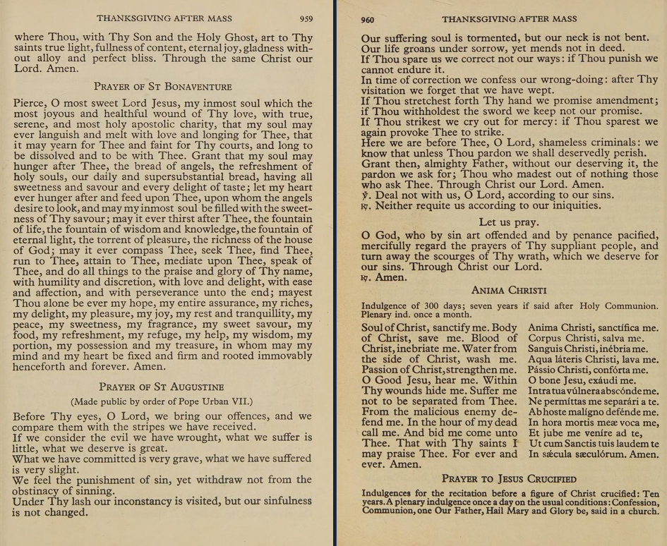

## Introduction

These are the notes of my attempt to trace the origins of a prayer known to me as the Prayer of St. Augustine. This page will be updated with any further progress.

## Roman Catholic Daily Missal, 1962

My first introduction to this prayer is from the Daily Missal, 1962 edition published by Angelus Press. My copy is copyright 2004, ISBN 978-1-892331-29-8, third printing November 2007.

The prayer appears on page 90 in the section "Prayers After Communion" as such:

> PRAYER OF ST. AUGUSTINE (†430)
>
> BEFORE Thine eyes, O Lord, we bring our sins, and we compare them with the stripes we have received.
>
> If we examine the evil we have wrought, what we suffer is little, what we deserve is great.
>
> What we have committed is very grievous, what we have suffered is very slight.
>
> We feel the punishment of sin, yet withdraw not from the obstinacy of sinning.
>
> Under Thy lash our inconstancy is visited, but our sinfulness is not changed.
>
> Our suffering soul is tormented, but our neck is not bent.
>
> Our life groans under sorrow, yet amends not in deed.
>
> If Thou spare us, we correct not our ways; if Thou punish, we cannot endure it.
>
> In time of correction we confess our wrongdoing; after Thy visitation we forget that we have wept.
>
> If Thou stretchest forth Thy hand, we promise amendment; if Thou withholdest the sword, we keep not our promise.
>
> If Thou strikest, we cry out for mercy; if Thou sparest, we again provoke Thee to strike.
>
> Here we are before Thee, O Lord, confessedly guilty; we know that unless Thou pardon we shall deservedly perish.
>
> Grant then, O almighty Father, without our deserving it, the pardon we ask; Thou Who madest out of nothing those who ask Thee. Through Christ our Lord. Amen.
>
> ℣. Deal not with us, O Lord, according to our sins.
>
> ℟. Neither reward us according to our iniquities.
> 
> *Let us pray.*
>
> O God, Who by sin art offended and by penance pacified, mercifully regard the prayers of Thy suppliant people, and turn away the scourges of Thy wrath, which we deserve for our sins. Through Christ our Lord. ℟. Amen.

The prayer appears only in English with no additional information.

## St. Andrew Daily Missal, 1953

Searching the internet for the prayer in English turns up surprisingly few results, given the supposed age of the prayer. One site that includes the prayer mentions that it was copied from the Saint Andrew Daily Missal.

Thanks to the Internet Archive, we can find a version of the Missal published in 1953 available for borrowing ([Link](https://archive.org/details/saintandrewdaily0000cath/page/960/mode/2up?view=theater)). The prayer is found on pages 959-960 in a section of prayers for "Thanksgiving After Mass". It appears worded very similar to the previous source, but is prefaced with the note that it was "Made public by order of Pope Urban VII."

It's unclear yet if the note about [Pope Urban VII](https://www.catholic.com/encyclopedia/pope-urban-vii) is accurate, given that the Pope only reigned for 13 days before his death.

Interestingly, the prayer does not seem to appear in the 1949 edition of [St. Andrew Daily Missal](https://archive.org/details/saintandrewdaily0000domg_p9t2/page/574/mode/2up) (expected around page 575).

<!--
"Ante oculos tuos, Domine"
https://archive.org/details/TheRaccolta1878/mode/2up
-->
